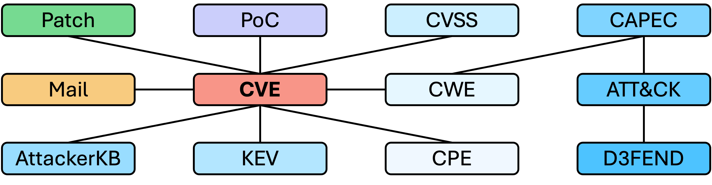

<p align="center">
  
</p>

## Introduction

VulZoo is a large-scale vulnerability intelligence dataset that integrates various sources of structural and non-structural data. It is designed to be used by security researchers, penetration testers, and security analysts to get a comprehensive view of vulnerabilities and their associated data.

This dataset is divided into two parts: raw data and processed data.

- `raw-data/`: contains the raw data from different sources.
- `processed/`: contains the processed data that is extracted or converted from the raw data.

VulZoo aims to provide the most comprehensive profiling of vulnerabilities for downstream tasks, e.g., vulnerability detection, assessment, prioritization, exploitation, and mitigation.

The following figure shows the conceptual overview of VulZoo:



[README.md in processed/](processed/README.md) provides more details about the processed data.

## Quick Start

If the existing data in VulZoo satisfies your demand, you can just clone this repository without `--recurse-submodules` option:

```bash
git clone https://github.com/NUS-Curiosity/VulZoo
```

The dataset is in `processed/` directory. If you need the up-to-date data, please following the data management process below.

## Data Management

Pre-requisites:

- Python 3.6+
- Disk space: 25GB+

VulZoo is composed of both git-based and non-git-based sources. The git-based sources are from upstream repositories and organized as git submodules in this repository. The non-git-based sources are crawled and maintained in this repository. To get started, clone the repository with the following command:

```bash
git clone --recurse-submodules https://github.com/NUS-Curiosity/VulZoo
```

VulZoo provides some useful scripts to help you manage the data. As some scripts require specific Python packages, it is recommended to install the required packages first:

```bash
pip install -r requirements.txt
```

You can run the `sync-raw-data.sh` script to incrementally update the local raw data:

```bash
./sync-raw-data.sh
```

Then, you can run the `sync-processed.sh` script to process the raw data and synchronize the processed data with the latest raw data:

```bash
./sync-processed.sh
```

P.S. 

- You can run `print-statistics.py` to get the statistics of the processed data.
- The updating of `attackerkb-database` requires API key provided by AttackerKB. Please set it via environment variable and run `sync-attackerkb.py` in `scripts/raw-data` manually.
- The CPE dictionary is too large to be uploaded to GitHub. Please run `sync-cpe.sh` scripts in both `scripts/raw-data` and `scripts/processed` locally.

## Data Sources

### Structural

- [CVE (Common Vulnerabilities and Exposures)](https://github.com/CVEProject/cvelist.git)
- [NVD (National Vulnerability Database)](https://github.com/fkie-cad/nvd-json-data-feeds.git)
- [CWE (Common Weakness Enumeration)](https://cwe.mitre.org/)
- [CAPEC (Common Attack Pattern Enumeration and Classification)](https://capec.mitre.org/)
- [CISA KEV (Known Exploited Vulnerabilities)](https://www.cisa.gov/known-exploited-vulnerabilities-catalog)
- [ZDI Advisory](https://github.com/delikely/ZDI_Advisories.git)
- [GitHub Advisory](https://github.com/github/advisory-database)
- [MITRE ATT&CK](https://github.com/mitre-attack/attack-stix-data.git)
- [MITRE D3FEND](https://d3fend.mitre.org/)
- [AttackerKB](https://attackerkb.com/)

### Non-structural

- [Exploit-DB](https://gitlab.com/exploit-database/exploitdb)
- [oss-security mailing list](https://www.openwall.com/lists/oss-security)
- [full-disclosure mailing list](https://lists.openwall.net/full-disclosure/)
- [bugtraq mailing list](https://lists.openwall.net/bugtraq/)
- [GitHub](https://github.com)
- [git.kernel.org](https://git.kernel.org/pub/scm/linux/kernel/git/torvalds/linux.git)

### Hybrid

- [Linux Kernel Vulns](https://git.kernel.org/pub/scm/linux/security/vulns.git)

## Citation

If you use this dataset, please cite the [VulZoo paper](https://dl.acm.org/doi/10.1145/3691620.3695345):

```
@inproceedings{10.1145/3691620.3695345,
author = {Ruan, Bonan and Liu, Jiahao and Zhao, Weibo and Liang, Zhenkai},
title = {VulZoo: A Comprehensive Vulnerability Intelligence Dataset},
year = {2024},
isbn = {9798400712487},
publisher = {Association for Computing Machinery},
address = {New York, NY, USA},
url = {https://doi.org/10.1145/3691620.3695345},
doi = {10.1145/3691620.3695345},
booktitle = {Proceedings of the 39th IEEE/ACM International Conference on Automated Software Engineering},
pages = {2334–2337},
numpages = {4},
location = {Sacramento, CA, USA},
series = {ASE '24}
}
```

